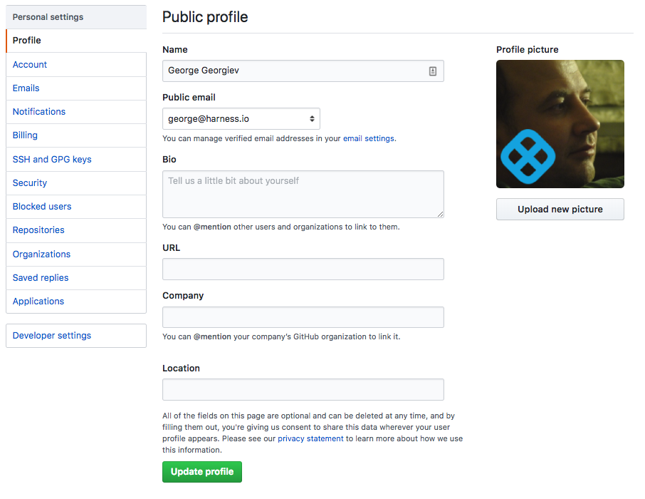
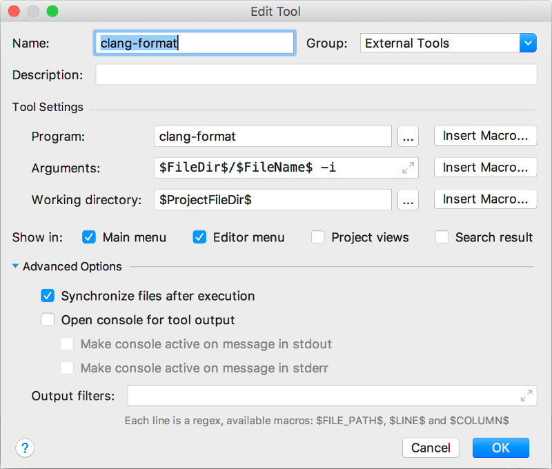
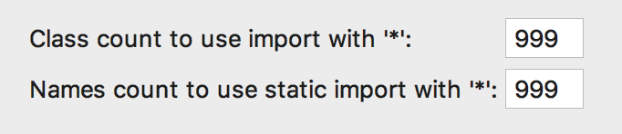
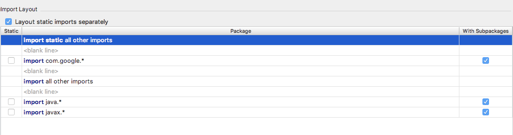

# Portal Project Dev environment setup instructions :

## On MacOS

### Prerequisities

1. Install Homebrew :

   `/usr/bin/ruby -e "$(curl -fsSL https://raw.githubusercontent.com/Homebrew/install/master/install)"`

2. Install Java 8 download : 
NOTE: Brew will download and install latest version of JDK/JRE, its recommended to install JDK/JRE_1.8.0_152 to be in sync with version everyone is using in the team.

Download JDK 1.8-152 from [Java archive downloads](http://www.oracle.com/technetwork/java/javase/downloads/java-archive-javase8-2177648.html), unzip it, then set `JAVA_HOME`, and `PATH` accordingly.

3. Install maven :

   `brew install maven`

4. Install and start MongoDB Docker Image (v3.6):

```
$ docker run -p 27017:27017 -v ~/_mongodb_data:/data/db --name mongoContainer -d --rm mongo:3.6
```
Install & use RoboMongo client to test MongoDB connection.

5. Install npm (used for front-end):
   `brew install npm`

6. **Set up JAVA_HOME: create or add this to your bash profile `~/.bash_profile` file and add following line:**

```
   ulimit -u 8192
   export JAVA_HOME=$(/usr/libexec/java_home -v1.8)
  
```

7. Go to http://www.oracle.com/technetwork/java/javase/downloads/jce8-download-2133166.html. Accept the license agreement and download the files. Unzip the files. Copy the two jars to `$JAVA_HOME/jre/lib/security` (you'll probably need to use sudo).

Run this script to test if JCE is installed properly:

`$JAVA_HOME/bin/jrunscript -e 'print (javax.crypto.Cipher.getMaxAllowedKeyLength("RC5") >= 256);'`

If you are under Ubuntu:

```
sudo add-apt-repository ppa:webupd8team/java
sudo apt update
sudo apt install oracle-java8-unlimited-jce-policy
```

8. Update /etc/hosts to reflect your hostname
```
255.255.255.255	broadcasthost
127.0.0.1  <your hostname>
::1        <your hostname>
```

### Github setup

1. Create harness dedicated github account. Use your harness email.

2. Make your email public as it is shown on the picture:

NOTE: This account will be used mostly in harness private repos, you should not be concerned for being over espoused.


3. Setup your public profile. The important fields are Name, Public email and Profile picture.
Please enter your First and Last name for the Name and select your harness email as Public email.
Please upload an easy to recognize image preferably of your face - with the team growing the autogenerated frogs from github are hard to use for identification.

NOTE: the data from it is used for every git operation github does on you behave as squashing changes or direct edits. This is why this is important.



### Git setup

1. Setup your harness email to the git config. You can do it globally or just for the portal repo:

    `git config --global user.name "FirstName LastName"`

    or just for portal with

    `git config user.name "FirstName LastName"`

2. Setup your name to the git config. We are using First and Last name. Please make sure you use the same spelling as you did for your github account.

### Build

1. Clone form git repository: https://github.com/wings-software/portal

   (Optional) Follow https://help.github.com/articles/adding-a-new-ssh-key-to-your-github-account/
   to setup your SSH keys. You can then use SSH to interact with git

2. Go to `portal` directory and run

   `mvn clean install`


### Run Harness without IDE (especially for the UI development)

1. Start server : Replace the <Your Home Directory> with the appropriate value(such as /home/rishi) and run following commands. Do
   
`export HOSTNAME` 

then

`mvn clean install -DskipTests && java -Xms1024m -Xmx4096m -XX:+HeapDumpOnOutOfMemoryError -XX:+PrintGCDetails -XX:+PrintGCDateStamps -Xloggc:mygclogfilename.gc -XX:+UseParallelGC -XX:MaxGCPauseMillis=500 -Xbootclasspath/p:<Your Home Directory>/.m2/repository/org/mortbay/jetty/alpn/alpn-boot/8.1.11.v20170118/alpn-boot-8.1.11.v20170118.jar -Dfile.encoding=UTF-8 -jar 71-rest/target/rest-capsule.jar 71-rest/config.yml > portal.log &`

2. Run DataGenUtil: Open a new terminal and run following command (Make sure you [setup `HARNESS_GENERATION_PASSPHRASE` environment variable](https://docs.google.com/document/d/1CddJtyZ7CvLzHnBIe408tQN-zCeQ7NXTfIdEGilm4bs/edit) in your Bash profile):

`java -Xmx1024m -jar 91-model-gen-tool/target/model-gen-tool-capsule.jar 91-model-gen-tool/config-datagen.yml`

3. Start Delegate : Open a new terminal and navigate to the same directory. And run following command:

`java -Xmx4096m -XX:+HeapDumpOnOutOfMemoryError -XX:+PrintGCDetails -XX:+PrintGCDateStamps -Xloggc:mygclogfilename.gc -XX:+UseParallelGC -XX:MaxGCPauseMillis=500 -jar 81-delegate/target/delegate-capsule.jar 81-delegate/config-delegate.yml &`

4. Start Verification service (Optional) : Open a new terminal and navigate to the same directory. And run following command:

`java -Xms1024m -Xmx4096m -XX:+HeapDumpOnOutOfMemoryError -XX:+PrintGCDetails -XX:+PrintGCDateStamps -Xloggc:mygclogfilename.gc -XX:+UseParallelGC -XX:MaxGCPauseMillis=500 -Xbootclasspath/p:<Your Home Directory>/.m2/repository/org/mortbay/jetty/alpn/alpn-boot/8.1.11.v20170118/alpn-boot-8.1.11.v20170118.jar -Dfile.encoding=UTF-8 -jar 79-verification/target/verification-capsule.jar 79-verification/verification-config.yml > verification.log &`

### Editing setup

1. Install clang-format - https://clang.llvm.org/docs/ClangFormat.html

`brew install clang-format`

helper shell scripts:

`git clang-format` - makes sure all staged in git files are reformatted

`find . -iname *.java | xargs clang-format -i` - formats all java files from the current directory down

### IntelliJ Setup

1. Install IntelliJ community edition
2. Import `portal` as maven project
3. Install ClangFormatIJ Plugin: https://plugins.jetbrains.com/plugin/8396-clangformatij
   (use `Ctrl/Cmd-Alt-K` to format current statement or the selection)

   **WARNING:** For unclear reason in some environments the plugin causes IntelliJ to hang. If you are unlucky
   to be one of those cases there is alternative. Please use the external 3rd-party tool integration as
   described here: https://www.jetbrains.com/help/idea/configuring-third-party-tools.html.
   Configure the tool to look like shown on the image:

   .

   Then follow these instructions https://www.jetbrains.com/help/idea/configuring-keyboard-shortcuts.html to
   assign whatever key combination you would like it to be triggered on.

4. Install Lombok Plugin: https://projectlombok.org/setup/intellij
5. Change settings to mark injected fields as assigned. (Settings > Editor > Inspections > Java > Declaration Redundancy > Unused Declarations>Entry Points >
   Annotations > Mark field as implicitly written if annotated by) Click add, then search for "Inject". Add both google and javax annotations.
6. Setup code style. Preferences > Code Style > Scheme > Gear icon > Import > IntelliJ XML.
   Select portal/tools/config/src/main/resources/intellij-java-google-style.xml
7. Setup your imports settings. From Preferences | Editor > Code Style > Java | Imports make sure that your limits are big enough to not take affect



Also make sure that the layout looks like this:

.

### Run from IntelliJ

1. Create the API Server application - "WingsApplication":  
   [Run > Edit Configurations...]

       * Add new Application:  
           Use the "+" on the left to add a new application. Call it "WingsApplication"

       * Set Main class:
           'WingsApplication' class (found at software.wings.app.WingsApplication) with the following configurations.

       * VM Options:  
           `-Xbootclasspath/p:<Your Home Directory>/.m2/repository/org/mortbay/jetty/alpn/alpn-boot/8.1.11.v20170118/alpn-boot-8.1.11.v20170118.jar`

       * Program Arguments:  
           `server config.yml`

       * Working Directory:  
           `$MODULE_DIR$`

       * Environment Variable:
           `JAVA_HOME=/Library/Java/JavaVirtualMachines/jdk1.8.0_<update number>.jdk/Contents/Home`

       * Use classpath of module:  
           rest

       * JRE:  
           Default (1.8 - SDK of 'rest' module)

       * Ensure [File > Project Structure > Project SDK] "java version" is 1.8.0_\<update number>. (update number - java build aupdate number, say 152)
       * Ensure [IntelliJ IDEA > Preferences > Build, Execution, Deployment > Compile > Java Compiler > Module] "Target Bytecode Version" is 1.8 for all modules.

2. Create the "DelegateApplication":  
   [Run > Edit Configurations...]
   _ Add new Application:  
    Use the "+" on the left to add a new application. Call it "DelegateApplication"

    _ Set Main class:  
    'DelegateApplication' class (found at software.wings.delegate.app.DelegateApplication) with the following configurations.

    _ VM Options:  
    `-Xbootclasspath/p:<Your Home Directory>/.m2/repository/org/mortbay/jetty/alpn/alpn-boot/8.1.11.v20170118/alpn-boot-8.1.11.v20170118.jar -Dversion=999.0.0`

    _ Program Arguments:  
    `config-delegate.yml`

    _ Working Directory:  
    `$MODULE_DIR$`

    _ Environment Variable:  
    `JAVA_HOME=/Library/Java/JavaVirtualMachines/jdk1.8.0_<update number>.jdk/Contents/Home`

    _ Use classpath of module:  
    delegate

    _ JRE:  
    Default (1.8 - SDK of 'delegate' module)

3. Create the Verification API Server application - "VerificationServiceApplication":
   [Run > Edit Configurations...]

       * Add new Application:
           Use the "+" on the left to add a new application. Call it "VerificationServiceApplication"

       * Set Main class:
           'VerificationServiceApplication' class (found at io.harness.app.VerificationServiceApplication) with the following configurations.

       * VM Options:
           `-Xbootclasspath/p:<Your Home Directory>/.m2/repository/org/mortbay/jetty/alpn/alpn-boot/8.1.11.v20170118/alpn-boot-8.1.11.v20170118.jar`

       * Program Arguments:
           `server verification-config.yml`

       * Working Directory:
           `$MODULE_DIR$`

       * Environment Variable:
           `JAVA_HOME=/Library/Java/JavaVirtualMachines/jdk1.8.0_<update number>.jdk/Contents/Home`

       * Use classpath of module:
           verification

       * JRE:
           Default (1.8 - SDK of 'rest' module)

       * Ensure [File > Project Structure > Project SDK] "java version" is 1.8.0_\<update number>. (update number - java build aupdate number, say 152)
       * Ensure [IntelliJ IDEA > Preferences > Build, Execution, Deployment > Compile > Java Compiler > Module] "Target Bytecode Version" is 1.8 for all modules.

### Show current git branch in command prompt

Add the following to your `~/.bash_profile` to display the current git branch in the command prompt:

```
parse_git_branch() {
  git branch 2> /dev/null | sed -e '/^[^*]/d' -e 's/* \(.*\)/ (\1)/'
}
export PS1="\[\033[34m\]\w\[\033[36m\]\$(parse_git_branch)\[\033[31m\] $\[\033[0m\] "
```

Alternatively, use Fish shell: `brew install fish` then set iterms command to `/usr/local/bin/fish`

### Before you can use the client:

1. Make sure your mongodb is running first.

2. Run API Server (WingsApplication): [Run > Run... > WingsApplication]

3. From within the IDE, run `rest/src/test/java/software/wings/integration/DataGenUtil.java` and

4. `rest/src/test/java/software/wings/service/impl/RoleRefreshUtil.java` to create the default users and roles.

5. Run DelegateApplication: [Run > Run... > DelegateApplication]

The admin username and password are in BaseIntegrationTest.java.

### Note:

1. To build UI Go to wingsui and follow READ me instructions.

2. To apply database migrations run following command in dbmigrations folder:

   `mvn clean compile exec:java`

### Common problems:
* If you get an error about missing build.properties when you start the server, do a mvn clean install.
* If you get a SupportedEllipticCurvesExtension NoClassDefFoundError, Its likely that jsse.jar in /Library/Java/JavaVirtualMachines/<JDK Version>/Contents/Home/jre/lib folder does not have this class definition. Copy this file from a Team member.
* If you go to https://localhost:8000/#/login and don't see content, go to https://localhost:8181/#/login to enable the certificate then try again.
* If still face not able to login then got to https://localhost:9090/api/version and enable certificate and try again.

### Python

* Refer to the readme under python/splunk_intelligence

### Troubleshooting

https://github.com/wings-software/portal/wiki/Troubleshooting-running-java-process
