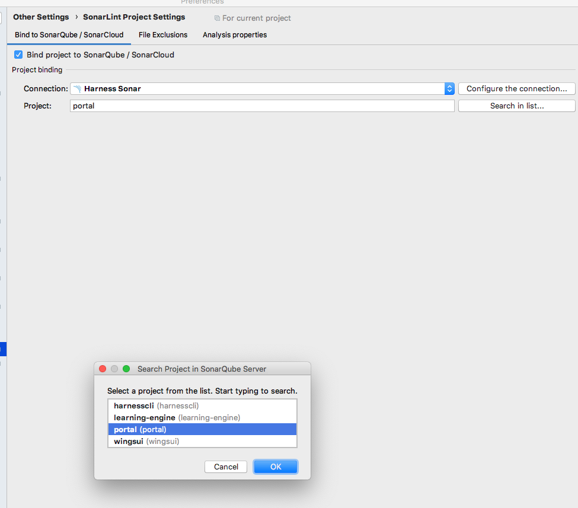
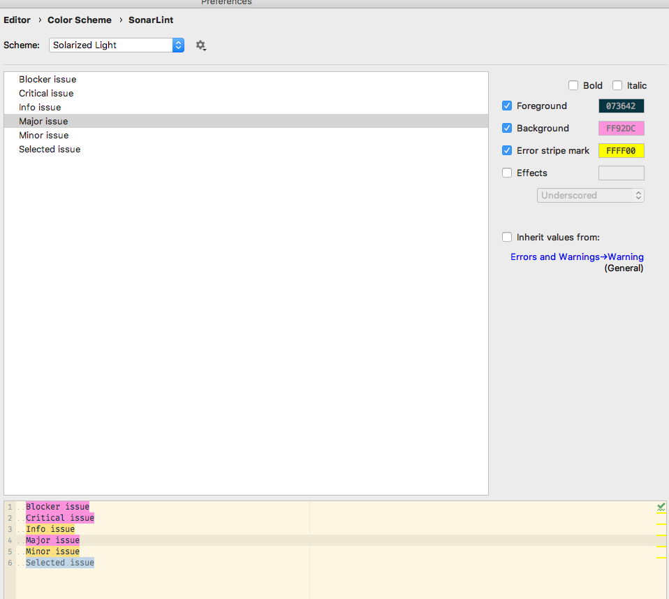
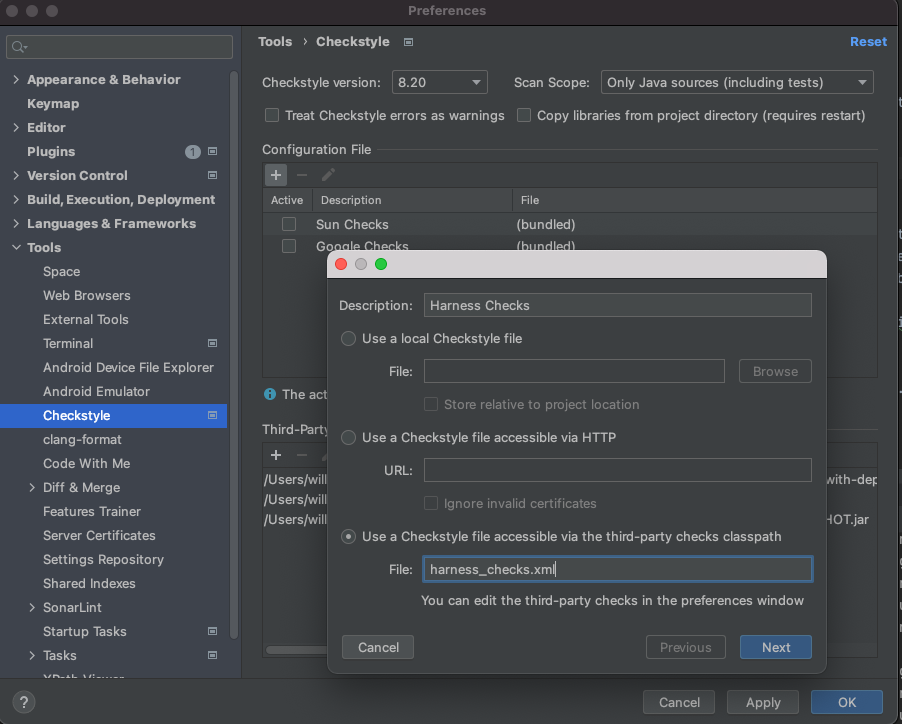
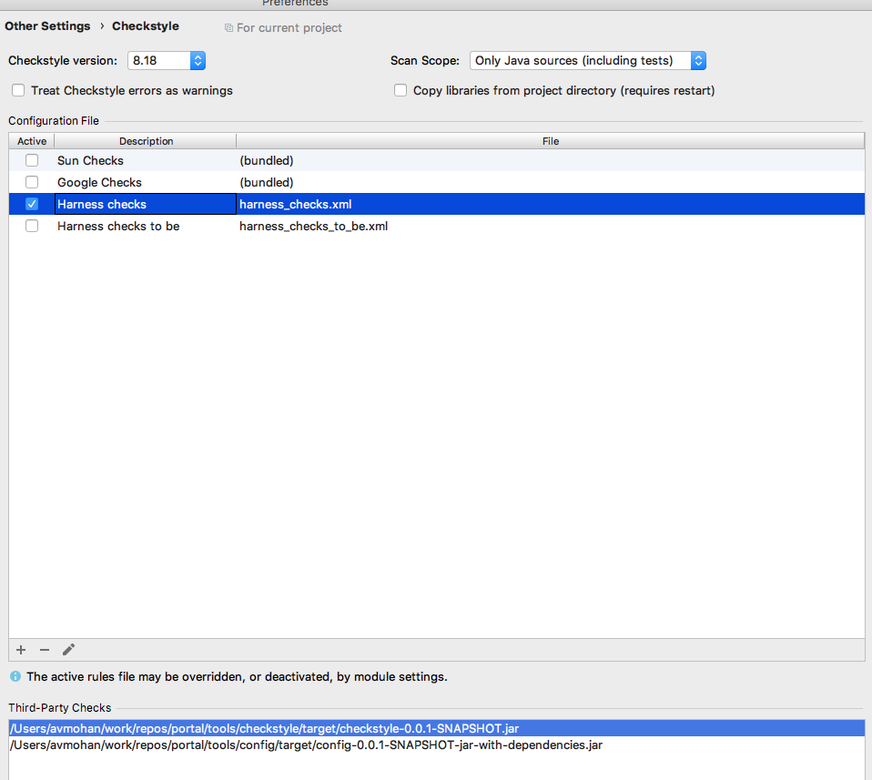
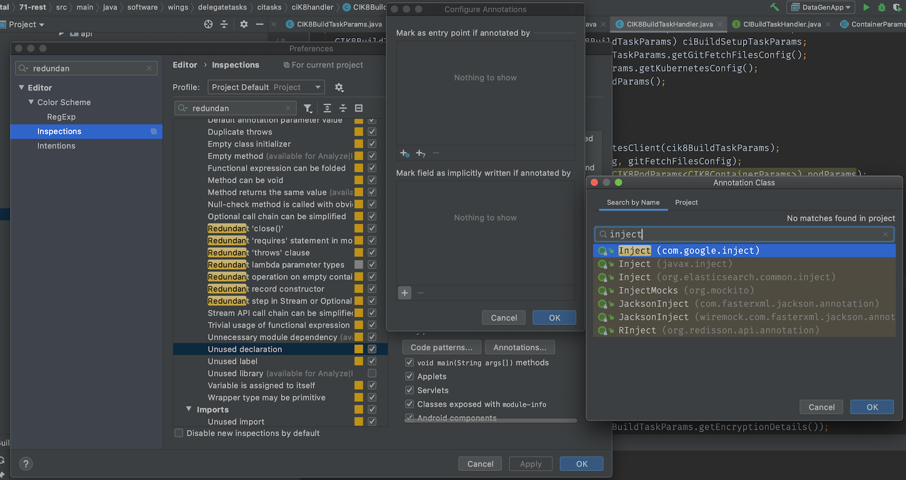
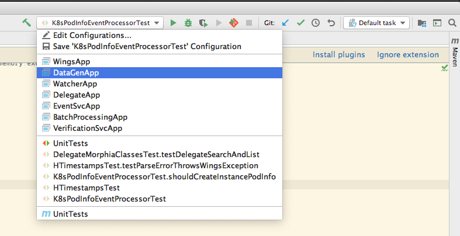

This repo contains code used in the [Harness CD Community Edition](https://github.com/harness/harness-cd-community) which is licensed under the [PolyForm Shield License 1.0.0](./licenses/PolyForm-Shield-1.0.0.txt). This repo also contains code belonging to Harness CD Enterprise Plan which is licensed under the [PolyForm Free Trial License 1.0.0](./licenses/PolyForm-Free-Trial-1.0.0.txt). You may obtain a copy of these licenses in the [licenses](./licenses/) directory at the root of this repository.

harness-core Project Dev environment setup instructions
==================================================
## On MacOS

### Prerequisities
1. Install Homebrew:
```
/bin/bash -c "$(curl -fsSL https://raw.githubusercontent.com/Homebrew/install/HEAD/install.sh)"
```

2. Download and Install Java 8
dd
NOTE: Brew will download and install latest version of OpenJDK/JRE, its recommended to install OpenJDK/JRE_1.8.0_242 to be in sync with version everyone is using in the team. 

Download OpenJDK 1.8-242 (jdk8u242-b08) JRE Installer from [Java archive downloads](https://adoptopenjdk.net/archive.html), unzip it, then set `JAVA_HOME` and `PATH` accordingly.

3. Install bazel:
```
brew install bazelisk

```

4. Install npm (used for front-end)
```
brew install npm
```

5. Set up JAVA_HOME: create or add this to your bash profile `~/.bashrc` or `~/.zshrc` file and add following line:
```
ulimit -u 8192
export JAVA_HOME=$(/usr/libexec/java_home -v1.8)
```

Do not add the first line on MacOS Catalina

If bash used, the better option migh be specifying full path to jdk, e.g:

```
export JAVA_HOME=/Library/Java/JavaVirtualMachines/adoptopenjdk-8.jdk/Contents/Home
```
6. Update /etc/hosts to reflect your hostname
```
255.255.255.255	broadcasthost
127.0.0.1  <your hostname>
::1        <your hostname>
```

7. Download and install `buf`
Complete this step only if you actively working with the protocol buffer files.
```
brew tap bufbuild/buf
brew install buf
```

To check if your protobuf files are according to the coding standards execute in the root of the repo
```
buf lint
```

### Git setup

1. Setup your harness email to the git config. You can do it globally or just for the harness-core repo:

    `git config --global user.email "email@harness.io"`

    or just for harness-core with

    `git config user.email "email@harness.io"`

2. Setup your name to the git config. We are using First and Last name. Please make sure you use the same spelling as you did for your github account.

    `git config --global user.name "FirstName LastName"`

    or just for harness-core with

    `git config user.name "FirstName LastName"`

3. Install git hooks. harness-core comes with a set of convenient productivity booster set of hooks. For security reasons they cannot be enabled automatically.
   To do so execute the following command from the root of already cloned locally repo:

    `toolset/git-hooks/install.sh`

    NOTE: if you clone the repo to another location you will have to do this again. On the other side you will be getting fixes and updates with no extra effort.

### Build

#### Some Bazel Best Practices you can follow before building harness-core locally.
`https://harness.atlassian.net/wiki/spaces/BT/pages/1910047082/Bazel+best+practices+for+faster+and+efficient+builds.`

1. Clone form git repository: https://github.com/harness/harness-core.git

   (Optional) Follow https://help.github.com/articles/adding-a-new-ssh-key-to-your-github-account/
   to setup your SSH keys. You can then use SSH to interact with git

3. Bazel install

    Create a file `.bazelrc` in your harness-core repo root with the following content
    ```
    import bazelrc.local
    ```
    NOTE: If you have regular bazel installed, please uninstall bazel and install bazelisk. It allows us to use the git repo to synchronize everyone's installation of bazel.

4. Setup the build purpose
   
   You need to set environment variable BUILD_PURPOSE with one of the following values:
   *   DEVELOPMENT - set this when you building for development purposes
   *   PR_CHECK    - set this when you building for executing check for the pr
   *   FEATURE     - set this when you building for internal feature testing
   *   RELEASE     - set this when you building for release
   
   if you seting up the project to build locally, you should simply add to your .bash_profile file: 
   ```
   export BUILD_PURPOSE=DEVELOPMENT
   ```
   
4. Go to `harness-core` directory and run

    `scripts/bazel/generate_credentials.sh`
    `bazel build //...` or `bazel build :all`

5. If Global Search is not required:

    Install and start MongoDB Docker Image (v4.2):
    ```
    $ docker run -p 127.0.0.1:27017:27017 -v ~/_mongodb_data:/data/db --name mongoContainer -d --rm mongo:4.2
    ```
    Verify the container is running using `docker ps`

    Install & use [RoboMongo](https://robomongo.org/download) client to test MongoDB connection.

6. If Global search has to be enabled (OPTIONAL):

    Install and start Elasticsearch Docker Image for Search(v7.3):
    ```
    $ docker run -p 9200:9200 -p 9300:9300 -v ~/_elasticsearch_data:/usr/share/elasticsearch/data -e "discovery.type=single-node" docker.elastic.co/elasticsearch/elasticsearch:7.3.0
    ```

    In harness-core/360-cg-manager/config.yml set `searchEnabled` to `true`.

    Run mongo in replica set:

    ```
    $ docker-compose -f <Directory to harness-core>/harness-core/docker-files/mongo-replicaset/docker-compose.yml up -d
    ```

    Add this to /etc/hosts:
    ```
    127.0.0.1       mongo1
    127.0.0.1       mongo2
    127.0.0.1       mongo3
    ```

    Run `brew tap mongodb/brew`
    Run `brew install mongodb-community@4.2`

    Run `mongo --port 30001`

    Run these in the mongo console:
    ```
    rs.initiate()
    rs.add('mongo2:30002')
    rs.add('mongo3:30003')
    ```

    In `360-cg-manager/config.yml` set `mongo.uri` to `mongodb://mongo1:30001,mongo2:30002,mongo3:30003/harness`.
    Do the same in `config-datagen.yml` and `verification-config.yml`.

7. If TimeScaleDB has to be enabled (Optional for now)

   a. Start TimeScaleDB using the following docker command: `docker run -d --name harness-timescaledb -v ~/timescaledb/data:/var/lib/postgresql/data -p 5432:5432 --rm -e POSTGRES_USER=admin -e POSTGRES_DB=harness -e POSTGRES_PASSWORD=password timescale/timescaledb`

   b. Set the TimeScaleDB config in the config.yml
  ```
  timescaledb:
    timescaledbUrl: jdbc:postgresql://localhost:5432/harness
    timescaledbUsername: admin
    timescaledbPassword: password
  ```
8. Install Redis - Follow the instructions from [here](https://gist.github.com/tomysmile/1b8a321e7c58499ef9f9441b2faa0aa8)


### Run Harness without IDE (especially for the UI development)
cd to `harness-core` directory
1. Start server by running following commands :

   * `bazel build //360-cg-manager:module_deploy.jar`
   * `curl https://storage.googleapis.com/harness-prod-public/public/shared/tools/alpn/release/8.1.13.v20181017/alpn-boot-8.1.13.v20181017.jar --output alpn-boot-8.1.13.v20181017.jar` [NOTE: alpn.jar will get download as part of generate_credentials.sh script as well.]
   * `java -Xms1024m -Xmx4096m -XX:+HeapDumpOnOutOfMemoryError -XX:+PrintGCDetails -XX:+PrintGCDateStamps -Xloggc:mygclogfilename.gc -XX:+UseParallelGC -XX:MaxGCPauseMillis=500 -Xbootclasspath/p:alpn-boot-8.1.13.v20181017.jar -Dfile.encoding=UTF-8 -jar ~/.bazel-dirs/bin/360-cg-manager/module_deploy.jar server 360-cg-manager/config.yml > harness-core.log &`

2. Generate sample data required to run the services locally by running the following step only once.
   DataGenUtil: Open a new terminal and run following command (Make sure you [setup `HARNESS_GENERATION_PASSPHRASE` environment variable](https://docs.google.com/document/d/1CddJtyZ7CvLzHnBIe408tQN-zCeQ7NXTfIdEGilm4bs/edit) in your Bash profile):

   * `java -Xmx1024m -jar ~/.bazel-dirs/bin/160-model-gen-tool/module_deploy.jar server  160-model-gen-tool/config-datagen.yml`

   or, preferably, with this command from bash console:

   * `bazel run 160-model-gen-tool:module --jvmopt="-Xbootclasspath/p:alpn-boot-8.1.13.v20181017.jar" server <harness-core project location>/160-model-gen-tool/config-datagen.yml`

   After command finishes, you might confirm in the mongodb account table that accountKey value is properly set.

3. Start Delegate

   * `java -Xmx4096m -XX:+HeapDumpOnOutOfMemoryError -XX:+PrintGCDetails -XX:+PrintGCDateStamps -Xloggc:mygclogfilename.gc -XX:+UseParallelGC -XX:MaxGCPauseMillis=500 -jar ~/.bazel-dirs/bin/260-delegate/module_deploy.jar 260-delegate/config-delegate.yml &`

4. Start Verification service (Optional)

   * `java -Xms1024m -Xmx4096m -XX:+HeapDumpOnOutOfMemoryError -XX:+PrintGCDetails -XX:+PrintGCDateStamps -Xloggc:mygclogfilename.gc -XX:+UseParallelGC -XX:MaxGCPauseMillis=500 -Xbootclasspath/p:alpn-boot-8.1.13.v20181017.jar -Dfile.encoding=UTF-8 -jar ~/.bazel-dirs/bin/270-verification/module_deploy.jar server 79-verification/verification-config.yml > verification.log &`

5. Start Command Library Service (Optional)

   * `java -Xms1024m -Xmx4096m -XX:+HeapDumpOnOutOfMemoryError -XX:+PrintGCDetails -XX:+PrintGCDateStamps -Xloggc:mygclogfilename.gc -XX:+UseParallelGC -XX:MaxGCPauseMillis=500 -Xbootclasspath/p:alpn-boot-8.1.13.v20181017.jar -Dfile.encoding=UTF-8 -jar ~/.bazel-dirs/bin/210-command-library-server/module_deploy.jar 210-command-library-server/command-library-server-config.yml > command_library_service.log &`

6. Start UI (Optional)

  * Create a shell script which pulls harness ui docker image and starts ui app. Name it e.g. `startui.sh` and replace <DOCKERHUBUSER> and <DOCKERHUBPASS> with the harness docker user credentials, found in Vault.
```
run_ui ()
{
    echo '<DOCKERHUBPASS>' | sudo docker login -u <DOCKERHUBUSER> --password-stdin;
    if [ ! -z "$1" ]; then
        tag=":$1";
    fi;
    sudo docker pull harness/ui$tag;
    sudo docker run -it -p 8000:8080 --rm -e API_URL=https://localhost:9090 harness/ui$tag
}  

alias runui='run_ui'
```
   * Add following line to ~/.bashrc: `source <path-to-startui-script>/startui.sh`
   * Execute .bashrc: `source ~/.bashrc`
   * Start ui by simply entering: `runui`
   * UI url will be found in logs.

   More info on this can be found [here](https://github.com/wings-software/wingsui/wiki/Docker-Harness-UI).
### Editing setup

1. Install [clang-format](https://clang.llvm.org/docs/ClangFormat.html) (11.0.0)
Download the clang 11.0.0 tar from [this page](https://releases.llvm.org/download.html)
Untar the downloaded file and add it to your PATH in `~/.bashrc` or `~/.zshrc`

```
echo "export PATH="$PATH:$HOME/<path-to-above-directory>/bin" >> ~/.zshrc
```

to format .graphql files: you can follow these steps:

* `npm install --global prettier@1.19.1`

* `prettier --write --print-width=120 <filename>` - formats given graphql file

helper shell scripts:

* `git clang-format` - makes sure all staged in git files are reformatted

* `find . -iname *.java | xargs clang-format -i` - formats all java files from the current directory down

### IntelliJ Setup

1. Install IntelliJ
   
   **NOTE** Bazel plugin usually doesn't support the latest IntelliJ versions, so install the [last supported version](https://github.com/bazelbuild/intellij/blob/master/intellij_platform_sdk/build_defs.bzl#L11).
2. Import `harness-core` as a Bazel project
   1. Open `File > Import Bazel Project...`
   1. Enter `/path/to/repo/harness-core` for Workspace, click Next
   1. Select `Import project view file` and enter `project/bazelproject` as the Project view
3. Install ClangFormatIJ Plugin: https://plugins.jetbrains.com/plugin/8396-clangformatij
   (use `Ctrl/Cmd-Alt-K` to format current statement or the selection)

   **WARNING:** For unclear reason in some environments the plugin causes IntelliJ to hang. If you are unlucky
   to be one of those cases there is alternative. Please use the external 3rd-party tool integration as
   described here: https://www.jetbrains.com/help/idea/configuring-third-party-tools.html.
   Configure the tool to look like shown on the image:

   .

   Then follow these instructions https://www.jetbrains.com/help/idea/configuring-keyboard-shortcuts.html to
   assign whatever key combination you would like it to be triggered on.

4. Install Lombok Plugin: https://projectlombok.org/setup/intellij
5. Install SonarLint plugin:
   - This plugin is really helpful to analyze your code for issues as you code.
   - Go to `Preferences -> Plugins` ->  type SonarLint -> Install plugin. (Will need to restart Intellij)
   - Go to `Preferences -> Tools -> SonarLint`. Check "Automatically trigger analysis". Add a connection to `https://sonar.harness.io`. You'll need to create a custom token.
   - Go to `Preferences -> Tools -> SonarLint -> Project Settings`. Check "Bind project to sonarqube", and select the connection, and set project as `portal_bazel`. This is so that we use the same rules locally instead of the default rules.
    .
   - Go to `Preferences -> Editor -> Colorscheme -> Sonarlint`. For Blocker, Critical & Major, untick "Inherit values from" checkbox and configure a different highlighting style. These violations are treated as release blockers and this configuration is to highlight them differently from regular warnings.
    .
   - Just right click on file in intellij and "Analyze with SonarLint" or enable autoscan.
6. Install the [Checkstyle-Idea Plugin](https://plugins.jetbrains.com/plugin/1065-checkstyle-idea).

   1. Run Maven build of the tools directory
      ```
      mvn -f tools/ clean install -DskipTests
      ```

   1. Setup Checkstyle plugin. In `Preferences -> Tools -> Checkstyle` add `tools/config/target/config-0.0.1-SNAPSHOT-jar-with-dependencies.jar` and `tools/checkstyle/target/checkstyle-0.0.1-SNAPSHOT.jar` jars in the repo to the 3rd party checks classpath. Add configuration file `harness_checks.xml` (Choose the option to resolve the file from the 3rd party checks classpath - it's within the config jar) and choose it as the default active. Set scan scope to  `java sources including tests`. In case Intellij complains about missing Harness rule files add following jar to Third-Party Checks `tools/checkstyle/target/checkstyle-0.0.1-SNAPSHOT.jar`. Additionally, check version of Checkstyle plugin to be 8.20 `Preferences > Tools > Checkstyle > Checkstyle Version:`
   *  .
   *  .
7. Change settings to mark injected fields as assigned. (Preferences -> Editor -> Inspections -> Java -> Declaration Redundancy -> Unused Declarations -> Entry Points ->
   Annotations -> Mark field as implicitly written if annotated by) Click add, then search for "Inject". Add both google and javax annotations.
   *  .

8. Increase Build Process Heap Size (Preferences > Build, Execution, Development > Compiler, search for "Build Process Heap Size" and set it to 2048 or higher if you still see an out of memory exception in future)

9. Install bazel project plugin from the IntelliJ marketplace

10. If facing build issues make sure you have enabled "Always update snapshots" in IntelliJ (Preferences > Build, Execution, Deployment > Build Tools > Maven)


### Run from IntelliJ

Run configurations for the different applications are already checked into the repo. Choose the appropriate run configuration from the menu.
While running an app from pre checked in configs, Add JAVA_HOME as an environment variable in Intellij.



### Show current git branch in command prompt

If you are using zsh (which is default on MacOS Catalina and later), basic git integration comes out of the box.

If you are using bash, add the following to your `~/.bash_profile` to display the current git branch in the command prompt:

```
parse_git_branch() {
  git branch 2 > / dev / null | sed - e '/^[^*]/d' - e 's/* \(.*\)/ (\1)/'
}
export PS1="\[\033[34m\]\w\[\033[36m\]\$(parse_git_branch)\[\033[31m\] $\[\033[0m\] "
```

Alternatively, use Fish shell: `brew install fish` then set iterms command to `/usr/local/bin/fish`

### Before you can use the client:

1. Make sure your mongodb is running first.

2. Run API Server (WingsApplication): [Run > Run... > WingsApplication]
    * If you get ALPN processor missing at start of WingsApp execute following curl command

        `curl https://storage.googleapis.com/harness-prod-public/public/shared/tools/alpn/release/8.1.13.v20181017/alpn-boot-8.1.13.v20181017.jar --output alpn-boot-8.1.13.v20181017.jar`

3. Run DataGenApp: [Run > Run... > DataGenApp]. Add HARNESS_GENERATION_PASSPHRASE environment variable to DataGenApp config in intellij.

4. Run DelegateApplication: [Run > Run... > DelegateApplication]

The admin username and password are in BaseIntegrationTest.java.

### Note:

1. To build UI Go to wingsui and follow READ me instructions.

2. To apply database migrations run following command in dbmigrations folder:

   `mvn clean compile exec:java`

### Common problems:
* If you get an error about missing build.properties when you start the server, do a mvn clean install.
* If you get a SupportedEllipticCurvesExtension NoClassDefFoundError, Its likely that jsse.jar in /Library/Java/JavaVirtualMachines/<JDK Version>/Contents/Home/jre/lib folder does not have this class definition. Copy this file from a Team member.
    * If you have `jsse.jar` but still getting that error, then make sure the default JDK for your maven module is set correctly in IntelliJ. Right Click Module in left sidebar > Open Module Settings > Platform Settings > SDKs)
* If you go to https://localhost:8000/#/login and don't see content, go to https://localhost:8181/#/login to enable the certificate then try again.
* If still face not able to login then got to https://localhost:9090/api/version and enable certificate and try again.
* If you get ALPN processor missing at start of WingsApp execute following curl command

    `curl https://storage.googleapis.com/harness-prod-public/public/shared/tools/alpn/release/8.1.13.v20181017/alpn-boot-8.1.13.v20181017.jar --output alpn-boot-8.1.13.v20181017.jar`

### Python

* Refer to the readme under python/splunk_intelligence


# Go Development
## Prerequisites
### Install Go
1. Install Go 1.14 [here](https://golang.org/dl/)
2. Add this to .bash_profile: `export PATH=$PATH:~/go/bin`
3. Install dependent tools by running:
```lang=bash
harness-core/tools/go/go_setup.sh
```
### Install Bazelisk
4. On mac: `brew install bazelisk`
   * Other platforms: Follow the instrictions [here](https://github.com/bazelbuild/bazelisk)


### IDE
Jetbrains has GoLand editor but its not free. If we continue using intelliJ for Go, then we need a plugin called Go, but it’s not supported on Community Edition(free) of intelliJ.
* So recommendation is to use VsCode(free) which is better than intelliJ for Go development.
* Once you install VsCode, open and install the plugin  `Microsoft Go`
* Note: If your autocomplete is not working, disable `gopls`

Alternately, gopls has a langserver implementation which hooks up cleanly to IntelliJ as LSP client.

## Documentation
This page contains the most common commands and recommendations, for more details go to [bazel homepage](https://docs.bazel.build/versions/master/getting-started.html).
Bazel has extensive documentation available online.

You can start with the [user guide](https://docs.bazel.build/versions/master/user-manual.html) and [best practices](https://docs.bazel.build/versions/master/best-practices.html)

Documentation about the Go ruleset is available on github as part of [bazelbuild/rules_go](https://github.com/bazelbuild/rules_go), most importantly go through the set of core rules for Go [here](https://github.com/bazelbuild/rules_go/blob/master/go/core.rst).


### Building

You should use the `bazel build` command to build a project:
```lang=bash
bazel build //path/to/project/...
```
For more information about build target pattern syntax run:
```lang=bash
bazel help target-syntax
```

Examples:
#### Building all packages under commons/go:
```lang=bash
bazel build //commons/go/...
```
Note that `//` stands for the repo root, if you run command from the repo root then you may omit it and instead run:
```lang=bash
bazel build commons/go/...
```

#### Building the entire harness-core repo:
```lang=bash
bazel build //...
```

#### Building all targets in the current folder:
```lang=bash
bazel build
```

#### Building all code in the current folder and all sub-folders:
```lang=bash
bazel build ...
```

#### Building all code in the directory foo:
```lang=bash
bazel build foo:all
```
For additional information, run:
```lang=bash
bazel help target-syntax
```

#### Cross-Compiling
You can cross-compile any go_binary target on demand to a specific platform by running:
```lang=bash
bazel build --platforms=@io_bazel_rules_go//go/toolchain:linux_amd64 //cmd
```

For details see the [Go rules for Bazel](https://github.com/bazelbuild/rules_go#how-do-i-cross-compile).


## Testing

Tests can be executed using the `bazel test` command:
```lang=bash
bazel test //path/to/project/... # will run all tests under //path/to/project
bazel test //path/to/project:target # will run the test named "target" under //path/to/project
```
Note that test targets tagged as `manual` are skipped in `...` if not specified explicitly.

Examples:
#### Running all tests under lib:
```lang=bash
bazel test //commons/go/lib/...:all --test_summary=detailed  # will run all tests under lib
```

#### Running tests in entire repo:
```lang=bash
bazel test //...
```

#### Running tests in the current folder:
```lang=bash
bazel test
```

#### Running a specific test:
```lang=bash
bazel test //commons/go/lib/logs:go_default_test
```

#### Running test in the current folder and all sub-folder:
```lang=bash
bazel test ...
```

#### Running tests in the sub-folder foo:
```lang=bash
bazel test foo:
```

#### Benchmark: Running benchmark tests:
```lang=bash
bazel run //commons/go/lib/<module>:"internal_tests" -- -test.bench=<keyword identifying the resolver> -test.benchmem
bazel run //commons/go/lib/logs:go_default_test -- -test.bench=harness -test.benchmem # an example
```

#### Browsing code coverage
```lang=bash
bazel coverage <target pattern>
bazel coverage //commons/go/lib/logs:go_default_test # an example
```

## Running

Bazel allows running executable targets using:
```
bazel run //path/to/target:target
bazel run //commons/go/lib/logs:go_default_test # an example
```

## Running docker builds with bazel

### Install gcloud
1. `brew install --cask google-cloud-sdk`
1. Add gcloud to your PATH
   1. Either, manually follow the onscreen instructions from brew
   1. Or, run the SDKs installer `/usr/local/Caskroom/google-cloud-sdk/latest/google-cloud-sdk/install.sh`
1. Run `gcloud init` to configure your installation
1. Please select `platform` project in GCP during the configuration.
1. Once all configurations done then you should be able to pull images from gcr registry.

### Build images
We have added flexibilities of building docker images with bazel. <br/>
Docker rule reference: https://github.com/bazelbuild/rules_docker. <br/>
To build docker images through bazel locally(i.e. access private images, push etc) we need to configure gcloud auth for docker. You can run these
commands to configure it locally:
```
gcloud components install docker-credential-gcr
gcloud auth login
gcloud auth configure-docker
```

## Managing Build Configuration

#### Generating BUILD.bazel files

BUILD.bazel files contain build rules. If you've added/removed packages or modified dependencies in the source code, or added new rules manually,
then you should run `gazelle` to update and format your BUILD.bazel files.
This tool will add any missing rules, update dependencies and format all BUILD.bazel files that you've touched.
Run in the root of the harness-core repository:

```lang=bash
gazelle
```

The above comand creates or updates `BUILD.bazel` files where needed. If the above command fails, it is likely due to using an incorrect version of gazelle. Currently we are using version `0.21`.

##### Building your own Gazelle

The rough overview is here, if you want more complete instructions go to the bazelbuild github page `https://github.com/bazelbuild/bazel-gazelle`.

```lang=bash
git clone git@github.com:bazelbuild/bazel-gazelle.git
cd bazel-gazelle
git reset origin/release-0.21 --hard
cd cmd/gazelle
baselisk build gazelle
$(bazelisk info bazel-bin)/cmd/gazelle/gazelle_/gazelle
# it expands out to something like below, giving the 0.21 binary
/home/tp/.cache/bazel/_bazel_tp/46ccc68b31f8c833946cfcd24410eb45/execroot/bazel_gazelle/bazel-out/k8-fastbuild/bin/cmd/gazelle/gazelle_/gazelle
```

#### Using gazelle to fix dependencies.
This can now be used in `harness-core` to fix dependencies.

We need to update the dependencies in `harness-core/WORKSPACE`. Run the following for your new/updated `go.mod`
```lang=bash
update_bazel_repo.sh commons/go/lib/go.mod # an example
```
This updates the `harness-core/WORKSPACE` file with new dependencies. Check-in `harness-core/WORKSPACE` file and any updated `go.mod` and `go.sum` files.


# How to use local module in an application outside the module
* We are using bazel for building and testing go source code. bazel needs BUILD.bazel files and doesn't need go.mod or go.sum files
go.mod and go.sum files  are needed for native go tools
* bazel uses $PROJECT_ROOT/WORKSPACE to store go repositories which has information found in both go.mod and go.sum bazel uses $PROJECT_ROOT/WORKSPACE for dependency management and BUILD.bazel for actual execution of targets

* To use local modules in an application
* for eg., to use module `lib` in an application `ci-addon`, we need to perform these actions:
```lang=bash
cd ci/addon #cd to the application folder where main.go is located
```
```lang=bash
go mod init <module-name>   # this generates go.mod and go.sum
```

* update go.mod by adding the following line to point to local repository (replace module and relative path to match yours):
```lang=bash
replace github.com/harness/harness-core/commons/go/lib => ../../../commons/go/lib
```
* (the above replace is needed only if you are outside the module you want to import)
```lang=bash
go get  # this updates go.mod
```
```lang=bash
gazelle  # generates, updates BUILD.bazel
```
* To update go_repository() at harness-core/WORKSPACE, run this script as:
```lang=bash
harness-core/tools/go/update_bazel_repo.sh go.mod
```

* Using GOPATH

Some editors like vscode requires the code to be structured in a `GOPATH` directory tree.
In this case, you may use the `:gopath` target to generate a directory tree with
symlinks to the original source files.

```
bazelisk build :gopath
```

You can then set the `GOPATH` in your editor to `bazel-bin/gopath`. If `bazel-bin` folder is not present in the root folder, use `$(bazel info bazel-bin)/gopath`.

# How to enable aws sdk logging in Manager/Delegate app locally
NOTE: Below changes are only recommended in local environment and changes shall not be pushed.

AWS SDK library internal logging is done using SLF4J. SLF4J serves as a simple facade or abstraction for various logging frameworks (e.g. java.util.logging, logback, log4j)

We are already using logback framework in our application, so it is simple to enable logging as it is already supported in SLF4J.
* Delegate - To enable AWS SDK logging in delegate, update root logger level to TRACE in logback.xml file in 260-delegate module resources folder and restart delegate.
* Manager - To enable AWS SDK logging in manager, update root logger level to TRACE in logback.xml file in 360-cg-manager module resources folder and restart manager. 

### Hotfix instructions

1. Create a new JIRA ticket(Don't use the feature branch).
2. Checkout the branch to hotfix on and make the changes.
3. Bump up the build number in the build.properties.
4. Create a pull request on this branch and master as well, make sure you merge them on master within the next 3 4 hours.
